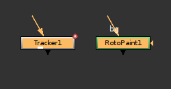
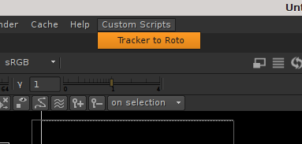
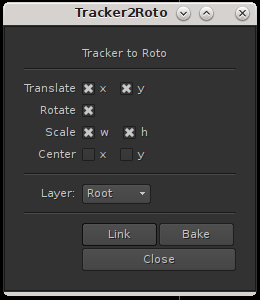

# tracker2roto
Script copy values from tracker to roto node.


### Instructions
1 Select Tracker and Roto/Rotopaint nodes

[]

2 Eval script

[]

3 Choose destination knobs and layer

[]

4 Use `Bake` or `Link` buttons to copy/link value

### Installation
Add following strings to your menu.py:
```python
import nuke
import tracker2roto

nuke.menu( 'Nuke' ).addCommand( 'Custom Scripts/Tracker to Roto', lambda: tracker2roto.tracker2Roto())
```
### Issues
It's impossible to bake values if there is expression in tracker knob

### License
MIT
